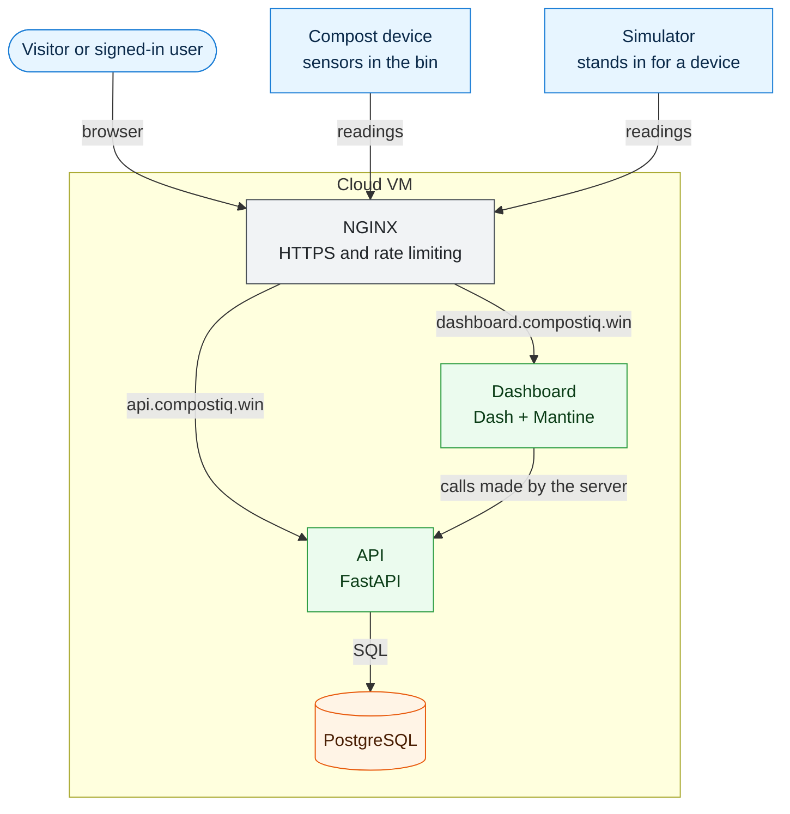
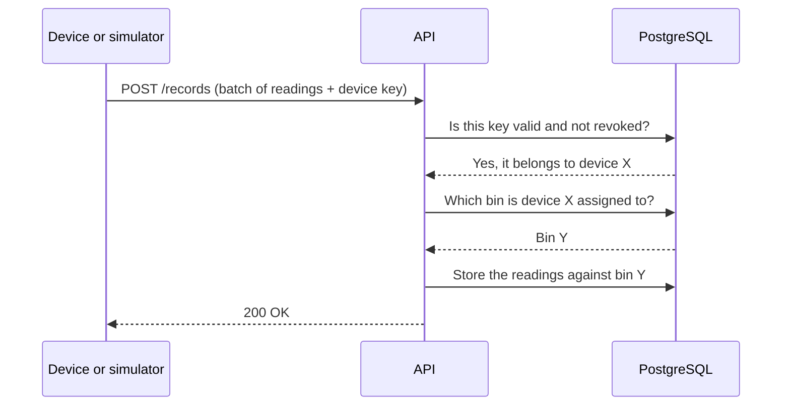
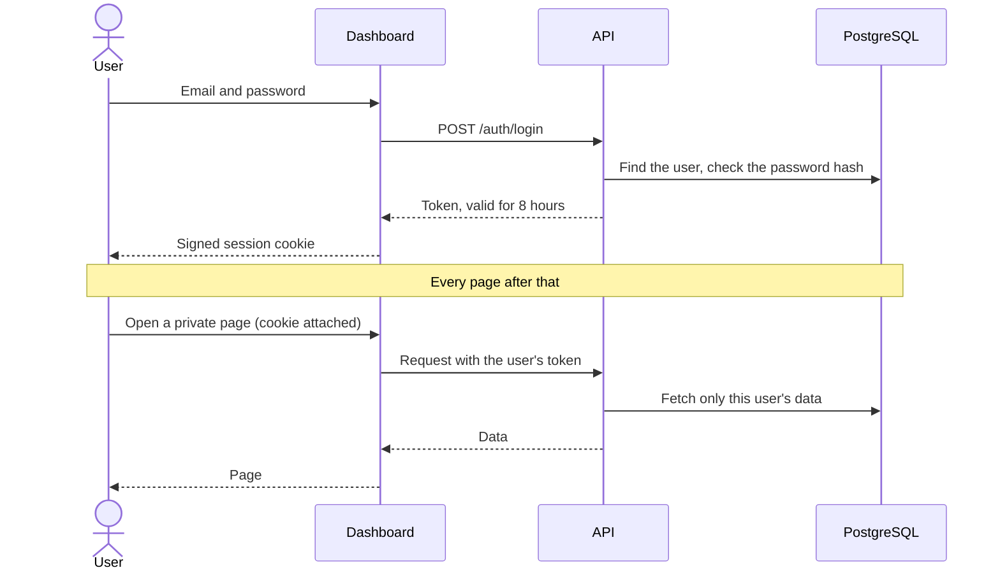
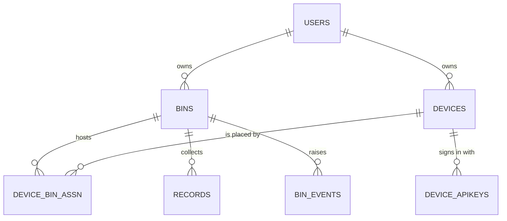
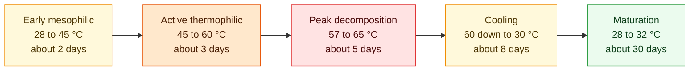

# CompostIQ

**An IoT system that monitors compost bins and tells people what to do next.**

Sensors inside a compost bin report temperature, moisture and gas levels to the cloud. A web dashboard turns those readings into something useful: which phase the compost is in, whether it is healthy, and when to turn it, water it or leave it alone.

CompostIQ is an RMIT capstone project, built around a pilot site in Mataram, Indonesia.

## Contents

- [What it does](#what-it-does)
- [Architecture](#architecture)
- [The systems](#the-systems)
- [How it works](#how-it-works)
- [Security model](#security-model)
- [Data model](#data-model)
- [The composting cycle](#the-composting-cycle)
- [Project status](#project-status)
- [Getting started](#getting-started)
- [Repository layout](#repository-layout)
- [Documentation](#documentation)

## What it does

| For | CompostIQ provides |
|---|---|
| **People who compost** | A dashboard for their own bins and devices: live readings, history, and alerts that say what action to take |
| **The public** | An open landing page. Anonymised, country-level statistics are planned |
| **Researchers and developers** | A simulator that produces realistic composting cycles, so the whole system can be built and tested without a physical bin |

## Architecture

CompostIQ is four systems with one rule between them: **only the API touches the database.** The dashboard and the devices both go through it.



Three ideas shape this design:

1. **The API is the single gatekeeper.** Every rule about who may see or change what is enforced in one place, next to the data.
2. **The browser never talks to the API.** The dashboard's server makes the calls, so a user's credentials never reach browser JavaScript.
3. **The simulator is just another device.** It uses the same endpoint and the same kind of key as real hardware, so nothing in the cloud is simulator-specific.

## The systems

| System | What it does | Built with | Folder |
|---|---|---|---|
| **API** | Receives readings from devices, manages user accounts, and is the only path to the database | FastAPI, SQLAlchemy Core, PyJWT, argon2 | [`backendAPI/`](backendAPI/README.md) |
| **Dashboard** | The website. Public landing page, sign-up and sign-in, and each user's bins, devices and charts | Dash, dash-mantine-components, Plotly | [`monitoringSystem/`](monitoringSystem/README.md) |
| **Simulator** | Generates a full composting cycle of sensor readings and sends it to the API as a device would. Runs on a developer's own machine | Dash, pandas, Plotly | [`simulator/`](simulator/README.md) |
| **Database** | Stores users, bins, devices, readings and alerts. Schema changes are versioned as migrations | PostgreSQL 16 | [`database/`](database/README.md) |
| **Deployment** | Runs the API and dashboard on one VM behind HTTPS | NGINX, PM2, Let's Encrypt | [`deploy/`](deploy/pm2/README.md) |

## How it works

### A reading's journey

A device collects readings and sends them in batches. The API works out which bin the device is assigned to and stores each reading against it.



Each reading holds a timestamp, temperature, moisture, oxygen, carbon dioxide and a relative ammonia level.

### Signing in

Users sign in on the dashboard. The API issues a token, and the dashboard keeps it in a signed cookie that browser scripts cannot read.



When the token expires the user is asked to sign in again, then returned to the page they were on.

## Security model

There are two kinds of caller, with separate credentials that cannot stand in for each other.

| Caller | Credential | Allowed to |
|---|---|---|
| **Device** | An API key, stored only as a hash | Send readings. Nothing else |
| **User** | A token (JWT) issued at sign-in, valid for 8 hours | Manage their own account, bins and devices |

- Passwords are stored as argon2 hashes.
- Ownership is checked in the database query itself, so a user can only ever reach their own data.
- The dashboard holds no database credentials. In production it is not even given the database address.
- Public pages are designed to show totals only, at country level: no names, locations or device identifiers.

## Data model

A user owns bins and devices. A device is assigned to a bin, and its readings are stored against that bin.



| Table | Holds |
|---|---|
| `users` | Accounts |
| `bins` | Compost bins, each owned by one user |
| `devices` | Sensor devices, each owned by one user once paired |
| `device_bin_assn` | Which device is in which bin, and when |
| `device_apikeys` | Hashed device keys, which can be revoked |
| `records` | Sensor readings. Each also remembers which device sent it |
| `bin_events` | Alerts raised for a bin |

Two smaller tables are left off the diagram: `setup_codes` (pairing codes) and `device_maintenance`.

- **Assignments keep their history.** Moving a device closes one assignment and opens another, so old readings stay with the bin they were taken in.
- **Deleting an account** removes its bins and readings, and releases its devices to be paired again.

## The composting cycle

Compost passes through five stages, each with its own expected temperature. CompostIQ uses these ranges to work out which stage a bin is in and whether its readings are healthy. The simulator uses the same ranges to generate data.



One milestone matters most: holding **55 °C or above for three days in a row** kills pathogens, which is the EPA Class A sanitation target.

The ranges and their sources are in [`simulator/composting_stages.py`](simulator/composting_stages.py).

## Project status

The project is in active development. This is what exists today.

| Area | Status |
|---|---|
| Devices sending readings to the API | ✅ Working |
| Simulator generating cycles and uploading them | ✅ Working, using a manually issued device key |
| User accounts: sign-up, sign-in, account page | ✅ Working |
| Dashboard pages for bins, devices and charts | 🟡 Interface built, showing placeholder data |
| Deployment to the VM | 🟡 Configured; sign-in release not yet deployed |
| API for a user's bins, devices and readings | ⬜ Designed |
| Pairing a device with a 6-digit code | ⬜ Designed |
| Alerts and health scoring | ⬜ Designed |
| Public statistics and country map | ⬜ Designed |

The agreed design for everything marked "Designed" is in [`docs/storyboard.md`](docs/storyboard.md).

## Getting started

You need [Docker](https://docs.docker.com/get-docker/) and [uv](https://docs.astral.sh/uv/). Run each command from the repository root.

> **Docker is only used for the local database.** It gives development and testing a PostgreSQL to run against. The API, dashboard and simulator run directly with Python, and the production VM does not use Docker.

**1. Start the database.** The first start loads the schema, the migrations and a development user.

```bash
docker compose up -d
```

**2. Install the dependencies.**

```bash
uv sync --all-packages
```

**3. Create the local settings files**, then set the secrets inside them. Each file explains how.

```bash
cp backendAPI/.env.example backendAPI/.env
```

```bash
cp monitoringSystem/.env.example monitoringSystem/.env
```

**4. Start the API**, in its own terminal.

```bash
uv run --directory backendAPI uvicorn main:app --port 8000
```

**5. Start the dashboard**, in another terminal.

```bash
uv run python monitoringSystem/app.py
```

Open <http://127.0.0.1:8050> and create an account.

To check that everything is wired up, run the API's tests:

```bash
uv run --directory backendAPI pytest
```

The simulator is optional and also uses port 8050, so stop the dashboard first or see its [README](simulator/README.md).

## Repository layout

```text
compost_iot_system/
├── backendAPI/          The API, and its tests
├── monitoringSystem/    The dashboard
├── simulator/           The device simulator
├── database/            Schema, migrations and the development seed
├── deploy/              NGINX and PM2 configuration for the VM
├── docs/                Storyboards and design decisions
├── mock-data/           Sample readings and the schema they follow
├── Archive/             The original prototype, kept for reference
└── compose.yaml         The local development database
```

## Documentation

| To learn about | Read |
|---|---|
| Endpoints, authentication and running the API | [`backendAPI/README.md`](backendAPI/README.md) |
| Pages, sign-in and the structure of the dashboard | [`monitoringSystem/README.md`](monitoringSystem/README.md) |
| Generating and inspecting composting cycles | [`simulator/README.md`](simulator/README.md) |
| The schema, and how to apply a migration safely | [`database/README.md`](database/README.md) |
| Setting up the VM | [`deploy/pm2/README.md`](deploy/pm2/README.md), [`deploy/nginx/README.md`](deploy/nginx/README.md) |
| User flows, page inventory and design decisions | [`docs/storyboard.md`](docs/storyboard.md) |
