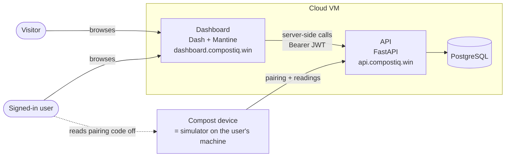
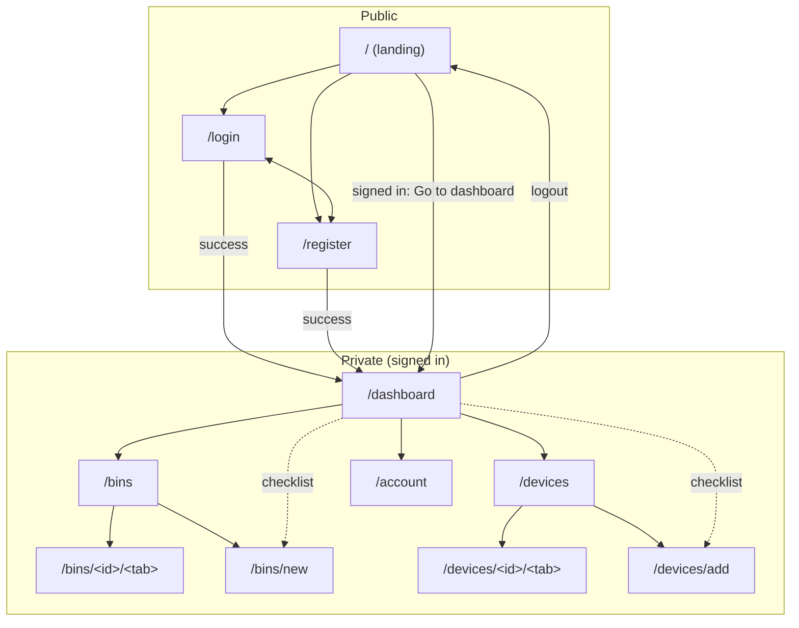
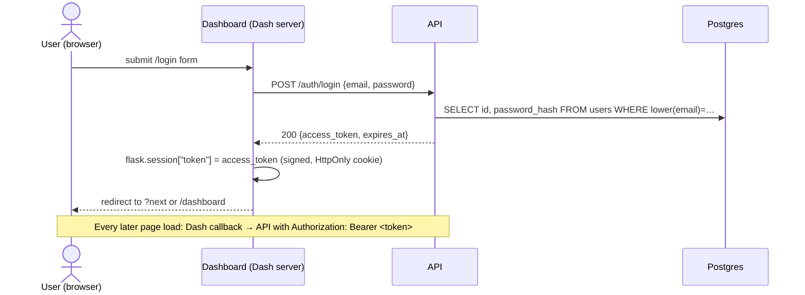
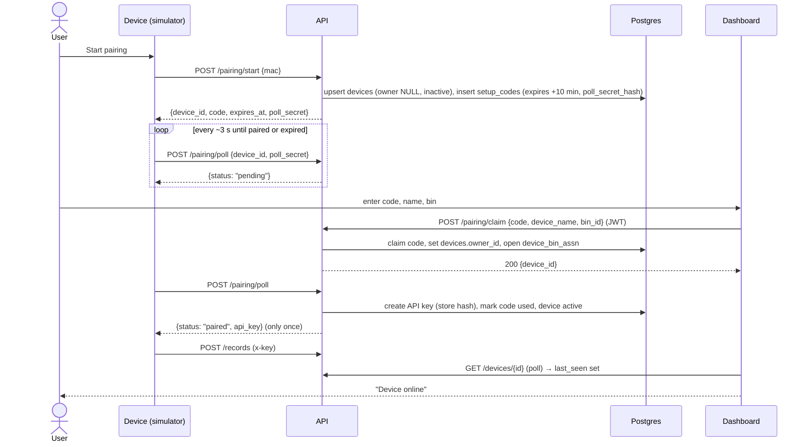
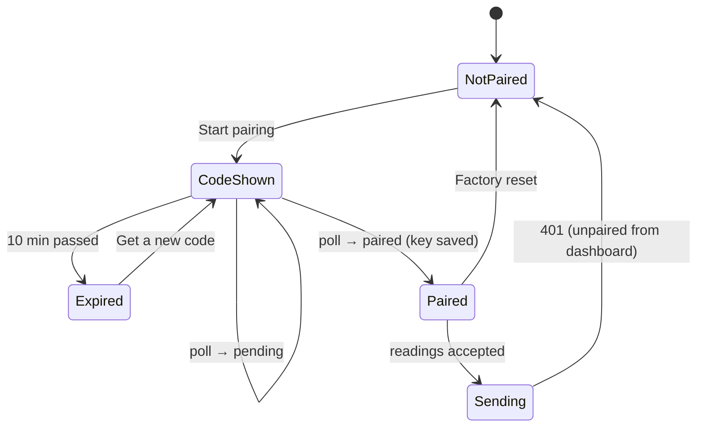
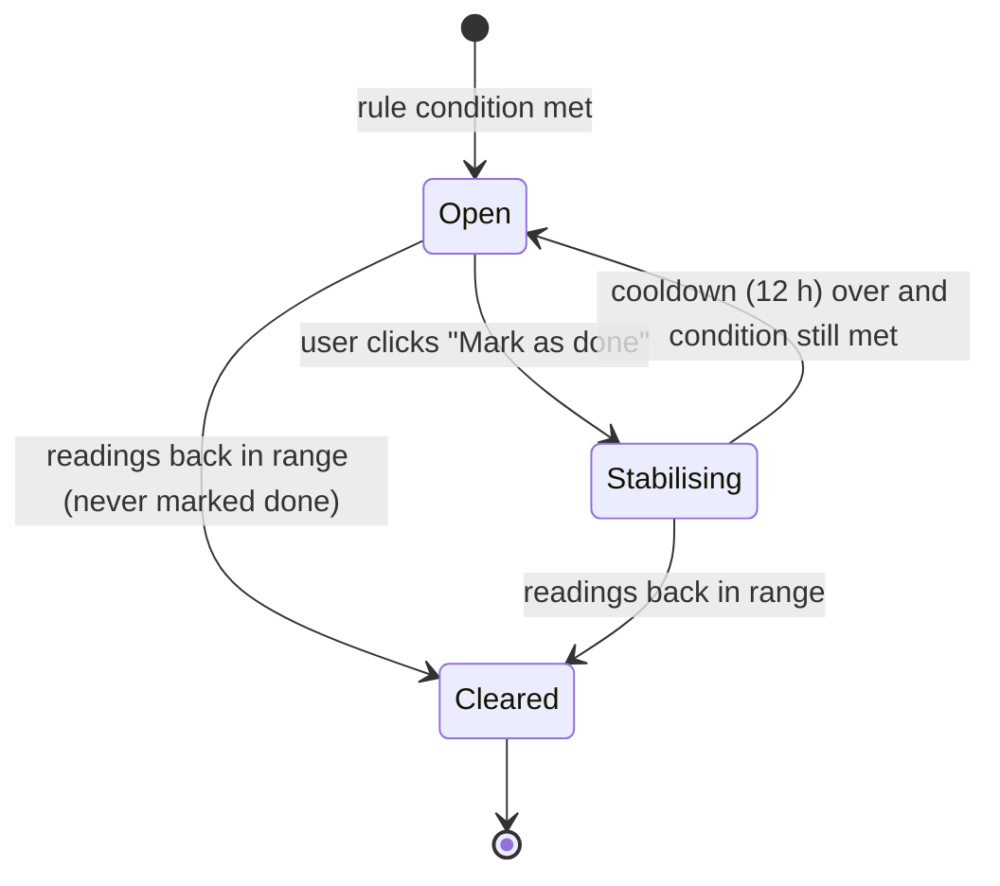

# CompostIQ — Storyboards & flows

Status: **agreed** (2026-09-29). Every open question is answered (§8). This is the blueprint for sign-in, the public site, device pairing and the dashboard's insights.

## Decisions this storyboard is built on

| Topic | Decision |
|---|---|
| Public page (`/`) | **Hero first**, then global stats, the country map and "How it works" |
| Signed-in user at `/` | **Stays on the landing page.** The top-right button reads "Go to dashboard" instead of "Sign in" |
| After sign-up | **Setup checklist** on an empty dashboard: create bin → pair device → first reading |
| Ownership | **One user owns** their bins and devices (`bins.user_id`, `devices.owner_id`). No organisations |
| Insights (phase, alerts, health) | **Rule-based**, using the stage ranges in `simulator/composting_stages.py`. Alerts are stored in `bin_events`. Rule-based maintenance suggestions are enough for the demo |
| Resolving alerts | **Action alerts** (turn / rotate, aerate, add water, add browns) can be marked done by the user. Marking one done opens a **"stabilising" follow-up alert** (e.g. "High temperature stabilising after mix"), which clears once readings are back in range. The action alert can't fire again for that bin until `ALERT_RESOLVE_COOLDOWN_HOURS` (in `.env`, default **12**) has passed. An alert that is never marked done **clears by itself** once conditions recover |
| Signed-in user at `/login` / `/register` | Redirected to `/dashboard` |
| Several devices per bin | The charts toggle between **Averages** and **All devices** (overlaid). Below them, per-device charts appear only for devices with an active alert |
| Bin/device URLs | `/bins/<id>/<tab>` and `/devices/<id>/<tab>` |
| Accounts | Self sign-up; an 8-hour JWT; no refresh tokens. A minimal **`/account`** page: display name, change password, delete account |
| Out of scope | Password reset and email verification |
| Public data | Country level only; every country is shown |
| Device | The simulator is a self-hosted device that pairs using a device-first 6-digit code |
| UI | dash-mantine-components 2.x (Mantine v8) |

---

## 1. Systems and actors

- The **browser never talks to the API directly**. Dash callbacks run on the server and call the API. The user's JWT lives in the signed Flask session cookie.
- Only the **API** touches the database.
- The **device** talks only to the API: it starts pairing, polls for its key, then sends readings with `x-key`.

---

## 2. Page inventory

### Dashboard (`dashboard.compostiq.win`)

| Route | Access | Purpose | Data (API) | Today |
|---|---|---|---|---|
| `/` | Public (signed-in users too) | Hero, global stats, country map, how it works | `GET /public/stats`, `/public/bins-by-country`, `/public/trends` | New (currently shows the mock overview) |
| `/login` | Public | Sign in, with `?next=` support | `POST /auth/login` | New |
| `/register` | Public | Create an account; signs in straight away | `POST /auth/register` | New |
| `/dashboard` | Private | Overview. Shows the setup checklist until the first reading arrives, then metrics, alerts, bins and devices | `GET /bins`, `GET /devices`, events | Mock exists |
| `/bins` | Private | The user's bins | `GET /bins` | Mock exists |
| `/bins/new` | Private | Create a bin (name, location, country) | `POST /bins` | UI exists |
| `/bins/<id>/<tab>` | Private | Bin detail. Tabs: live · history · maintenance · devices · settings | `GET /bins/{id}`, `/records`, `/events` | Mock exists as `/bin/<tab>` (no id) |
| `/devices` | Private | The user's devices | `GET /devices` | Mock exists |
| `/devices/add` | Private | Pairing wizard | `POST /pairing/claim` | UI exists |
| `/devices/<id>/<tab>` | Private | Device detail. Tabs: live · history · settings (rename, move, unpair) | `GET/PATCH/DELETE /devices/{id}` | Mock exists as `/device/<tab>` |
| `/account` | Private | Display name, change password, delete account | `GET/PATCH /auth/me`, `POST /auth/change-password`, `DELETE /auth/me` | New |

**Shells**
- **Public shell** (`/`, `/login`, `/register`): a header with the logo. Top right shows **"Sign in" / "Create account"** when signed out, and **"Go to dashboard"** when signed in. No navbar.
- **App shell** (every private page): the current AppShell with header and navbar. The navbar footer shows the signed-in user's name and email, linking to `/account`, and a **Logout** button. This replaces the hard-coded "UNRAM Pilot".

**Rules**
- A signed-in user **stays on `/`**; only the header button changes.
- A signed-in user who opens `/login` or `/register` is redirected to `/dashboard`.
- A signed-out user who opens a private route is redirected to `/login?next=<route>`.
- An unknown route shows a 404 page with a link home. It should not silently show the overview, which is what happens today.

### Device (the simulator, on the user's machine)

| Screen | Purpose |
|---|---|
| Simulator (existing) | Generate and inspect composting cycles |
| **Device / Pairing** (new tab or page) | Pairing state: Not paired → Code shown → Paired. Also shows the device ID and a factory reset button |

### Site map

---

## 3. Storyboards

Each storyboard is a sequence of frames. A frame is one screen state, what the user does there, and what the system does in response.

### S1 — Public visitor

| # | Screen | User | System |
|---|---|---|---|
| 1 | `/` hero: "Better compost, backed by data." [Create free account] [See the data ↓]. Top right: [Sign in] [Create account], or [Go to dashboard] when signed in | Scrolls, or clicks "See the data" | Scrolls to the stats |
| 2 | Stat tiles: bins · countries · active devices · readings (24h) | Reads | `GET /public/stats` (cached ~5 min) |
| 3 | Country choropleth + top-countries bar | Hovers a country | Tooltip: country name and bin count. Nothing more |
| 4 | 30-day global trend (average temperature and moisture) | Reads | `GET /public/trends` |
| 5 | "How it works": 1 Plug in → 2 Pair → 3 Watch | Clicks "Create account" | → `/register` |

**Must not show:** bin names, locations, owners, device IDs or MAC addresses (rule P1).

### S2 — Sign-up → setup checklist

| # | Screen | User | System |
|---|---|---|---|
| 1 | `/register`: email, display name (optional), password, confirm password | Fills in the form and submits | Validates on the client first: email format, password ≥ 8 characters, passwords match |
| 2 | Loading state on the button | — | `POST /auth/register` → 201 + JWT, stored in the session |
| 2a | Inline error: "An account with this email already exists. Sign in?" | — | The API returned 409 |
| 3 | `/dashboard`, empty. **Checklist**: ✓ account · ○ create bin · ○ pair device · ○ first reading | Clicks "Create bin →" | → `/bins/new` |
| 4 | `/bins/new` | Enters a name, location and country, then submits | `POST /bins` → back to `/dashboard`; step 2 is ticked |
| 5 | Checklist | Clicks "Pair →" | → `/devices/add` (**S4**) |
| 6 | Once the first reading arrives, the checklist is replaced by the normal overview (metrics, alerts, bins, devices) | — | The checklist is complete |

**Checklist state** is worked out from the data; nothing is stored:
- **step 2** is done when the user has at least one bin
- **step 3** is done when at least one device is active
- **step 4** is done when any of their bins has at least one reading

### S3 — Sign-in

| # | Screen | User | System |
|---|---|---|---|
| 1 | `/login` (possibly `?next=/bins/…`) | Enters email and password | — |
| 2 | Loading | — | `POST /auth/login` |
| 2a | "Email or password is incorrect." (the same message for both) | Tries again | 401. After too many attempts, 429: "Too many attempts, try again in a few minutes" |
| 3 | Lands on `next`, or `/dashboard` | — | The token is stored in the session and expires after 8 hours |

### S4 — Pairing a device (end to end, across two screens)

The user has **two windows open**: the device's local page (the simulator) and the dashboard.

| # | Device screen | Dashboard screen | System |
|---|---|---|---|
| 1 | "Not paired" + [Start pairing] | — | The device has no saved state |
| 2 | Big **`004 213`**, a 10:00 countdown, "Enter this code in your CompostIQ dashboard" | — | `POST /pairing/start {mac}` → `{device_id, code, expires_at, poll_secret}`; the device polls every ~3 s |
| 3 | (still showing the code) | `/devices/add` step 1: enters `004213` | — |
| 4 | | Step 2: names the device ("Outer Sensor") and picks or creates a bin | — |
| 5 | | Step 3: "Waiting for your device…" | `POST /pairing/claim` → the code is claimed; the device now belongs to the user and is assigned to the bin |
| 6 | "Paired ✓ with Outer Sensor" | | The poll returns `{status: paired, api_key}` **once**; the device saves it |
| 7 | Starts sending readings | "Device online ✓" → [Go to bin] | The first `POST /records` arrives; the dashboard sees a reading |

**Device pairing states**

### S5 — Signed-in daily use

| # | Screen | User | System |
|---|---|---|---|
| 1 | `/dashboard`: metric cards (latest temperature, moisture, O₂, health), "Needs attention" alerts, bins, devices | Sees "Temperature is running high · Bin 1 · Turn the pile" | Alerts are open `bin_events` for the user's bins |
| 2 | Clicks the alert or bin → `/bins/<id>/live` | Switches the range 6h / 24h / 7d and **Averages / All devices** | `GET /bins/{id}/records?from=` (per device, averaged in the dashboard) |
| 2a | Below the main charts: a chart for each **device with an active alert** (e.g. "Inner Sensor · too hot") | Looks at the device causing the problem | Only devices with open alerts get their own chart |
| 3 | `/bins/<id>/maintenance`: suggested actions from open alerts, plus the next expected phase change | Turns the pile, then clicks **[Mark as done]** on the "turn the pile" alert | `PATCH /bins/{id}/events/{event_id}` sets `resolved_at` and opens an info alert, **"High temperature stabilising after mix"**. `too_hot` is held back for `ALERT_RESOLVE_COOLDOWN_HOURS` (12 h) for this bin |
| 3a | The temperature drops back into range | The "stabilising" alert disappears | The stabilising alert clears by itself |
| 3b | *Or:* 12 h later the pile is still > 65 °C | Sees a new "Temperature is running high" alert | The cooldown has passed, so the rule fires again; the stabilising alert closes |
| 4 | `/bins/<id>/history`: temperature over time with phase bands, the pathogen-kill (55 °C) line, the health trend | Reads | `GET /bins/{id}/records` (daily aggregates for long ranges) |
| 5 | `/devices/<id>/settings` | Renames or moves the device to another bin | `PATCH /devices/{id}` |

### S6 — Unpairing a device

| # | Dashboard | Device | System |
|---|---|---|---|
| 1 | `/devices/<id>/settings` → [Unpair device] → confirmation modal "Readings already recorded stay in the bin's history" | — | — |
| 2 | Device removed from the list | Its next upload gets **401** | `DELETE /devices/{id}`: keys revoked, `owner_id` NULL, assignment closed |
| 3 | — | Clears the saved state → "Not paired" | The device can now be paired again, by anyone |

### S7 — Account page

| # | Screen | User | System |
|---|---|---|---|
| 1 | Navbar footer (name + email) → `/account` | — | `GET /auth/me` |
| 2 | **Profile** card: display name [Save] | Changes the name | `PATCH /auth/me {display_name}`; the navbar updates |
| 3 | **Password** card: current password, new password, confirm | Submits | `POST /auth/change-password`. A wrong current password shows an inline error (401). Success shows a notification |
| 4 | **Danger zone**: [Delete account] → modal "This deletes your bins, devices and all their readings. Type your email to confirm" | Types the email and confirms | `DELETE /auth/me` (needs the current password or the typed email). Cascades to bins, device assignments, readings and events; the user's devices are unpaired and their keys revoked. Session cleared → `/` |

Deleting an account needs the `ON DELETE` rules the audit flagged as missing (schema gaps).

---

## 4. Edge flows

| Trigger | The user sees | The system does |
|---|---|---|
| Token expires (8 h) mid-session | A "Your session expired, please sign in again" notification, then `/login?next=<current page>` | The API returns 401 → `api_client` clears the session |
| Opening a private URL while signed out | `/login?next=…` | Route guard |
| Opening someone else's bin or device by URL | 404 page | The API returns 404, never 403 (R5) |
| New user with no data | The setup checklist | Worked out from `GET /bins` / `GET /devices` |
| Pairing code expires before it's entered | Device: "Code expired" + [Get a new code]. Dashboard: "That code has expired. Ask the device for a new one" | `/pairing/claim` returns 404 |
| Wrong code entered | "That code doesn't match a device waiting to pair" | 404. After 5 wrong tries in 15 minutes: 429 "Too many attempts" |
| Code already claimed by someone else | Same message as a wrong code (doesn't reveal that it exists) | 409, shown to the user as not found |
| Device restarts after pairing | Nothing; it keeps sending | Saved state on the device |
| A reading is out of range or malformed | — | 422 and the batch is rejected (A7); the device logs it |
| A device stops reporting | "Offline since 14:05" badge on the device and bin | Worked out when read, from `last_seen_at` (for example > 2× the sampling interval) |
| A resolved alert's condition is still true | Nothing until the cooldown ends, then a new alert | The rule engine skips that alert type for the bin until `resolved_at + ALERT_RESOLVE_COOLDOWN_HOURS` |
| API is down | "Can't reach CompostIQ right now" notification; the page keeps its last data | `api_client` timeout → a friendly error |

---

## 5. Insight rules (phase · alerts · health)

These rules replace the mock's hard-coded insights. The ranges come from `simulator/composting_stages.py`, so the device and the cloud agree.

**Phase.** The temperature bands overlap (Cooling is 30–60 °C, which covers Active Thermophilic's 45–60 °C). So phase = temperature band **plus the 24-hour trend**:
- rising, below 45 °C → Early Mesophilic
- 45–57 °C and rising → Active Thermophilic
- 57 °C or more → Peak Decomposition
- falling after the peak → Cooling
- 28–32 °C, flat after cooling → Maturation

**Alerts** are written to `bin_events` when readings arrive. At most one open alert per type per bin.

| Type | Rule | Severity | Suggested action | When marked done → follow-up alert |
|---|---|---|---|---|
| `too_hot` | temperature > 65 °C | high | **Turn / rotate the pile** to release heat | `hot_stabilising`: "High temperature stabilising after mix" |
| `low_oxygen` | O₂ < 2 % | high | **Turn / aerate the pile**. It's going anaerobic | `oxygen_recovering`: "Oxygen recovering after aeration" |
| `too_dry` | moisture < 40 % | medium | **Add water** (about 3 L per 100 L of material) | `moisture_stabilising`: "Moisture stabilising after watering" |
| `too_wet` | moisture > 65 % | medium | **Add dry browns** (leaves, cardboard) | `moisture_stabilising`: "Moisture stabilising after adding browns" |
| `pathogen_kill_met` | ≥ 55 °C held for 3 days in a row | info | 🎉 EPA Class A sanitation reached | Informational; can be dismissed |
| `device_offline` | no reading for 2× the interval | medium | Check the device's power and Wi-Fi | Clears by itself when readings resume *(worked out when read, not stored)* |

**Alert lifecycle** (the four action alerts):

- **Open** is the action alert ("Add water"). **Stabilising** is an info follow-up ("Moisture stabilising after watering"). Both are rows in `bin_events`, so the follow-up keeps a record of what the user did.
- While a bin is in cooldown for an alert type, the rule engine won't open a new action alert of that type. It only updates or closes the stabilising alert.
- **Cooldown setting:** `ALERT_RESOLVE_COOLDOWN_HOURS=12`, read by the API from `.env`. PM2 passes it to the API only.

**Health score** (0–100) = the share of the last 24 hours of readings where each sensor was inside the **current phase's** band. It's averaged across sensors, the same idea as the simulator's stat cards.

**Several devices in one bin:**
- **Averages** (default): one line per sensor, averaged across the bin's devices in each time bucket.
- **All devices**: every device's line overlaid, colour-coded by device.
- Below the main charts, a separate chart for each device with an **open alert**, so the device causing a problem is easy to see. Devices without alerts get no extra chart.

---

## 6. Access rules

These are summarised here; the full table is in the planning notes. The API enforces them all, and the dashboard's page guard is only for a better experience.

- **R1–R5.** Private endpoints require a JWT. Bins, devices, records and events are filtered by owner **in SQL**. Anything you don't own returns 404.
- **R6–R10.** Device keys can only write `/records`. A pairing code is used once, is valid for 10 minutes, and allows 5 wrong tries per 15 minutes. The key is returned once, only to the holder of the poll secret. Unpairing revokes keys immediately.
- **P1–P2.** Public endpoints return totals only, at country level, with every country shown.
- **Account.** `/auth/me` endpoints only ever act on the token's own user. Deleting the account requires re-confirming (the current password or the typed email).

---

## 7. New endpoints this storyboard adds

These are on top of the planning notes' API list.
- `PATCH /auth/me`: update the display name.
- `POST /auth/change-password`: `{current_password, new_password}`.
- `DELETE /auth/me`: delete the account (with confirmation).
- `PATCH /bins/{id}/events/{event_id}`: resolve an alert. Only for alert types the user is allowed to resolve; starts the cooldown.
- `GET /bins/{id}/records` returns records **per device** (with `device_id`), so the dashboard can average them or draw one line per device.

---

## 8. Answers (2026-09-29)

1. **Signed-in user at `/`**: stays on the landing page. Top right shows "Go to dashboard" instead of "Sign in".
2. **Resolving alerts**: it depends on the alert. Turn/rotate-the-compost alerts can be resolved by the user. The alert can fire again (e.g. high temperature later), but only after a cooldown, `ALERT_RESOLVE_COOLDOWN_HOURS`, default 12, set in `.env`.
3. **Account page**: yes, minimal: display name, change password, delete account.
4. **Password reset / email verification**: out of scope.
5. **Several devices per bin**: show all the charts, with a toggle between averages only and all devices overlaid. Below them, alert-specific charts for devices that have alerts.
6. **`/bins/<id>/<tab>` URLs**: yes.
7. **Rule-based maintenance suggestions**: enough for the demo.

8. **Moisture alerts**: "add water" and "add browns" are action alerts too. When one is marked done, a follow-up "stabilising" alert takes its place (the same as "High temperature stabilising after mix" for turning). Otherwise an alert clears by itself once conditions are back in range.
9. **Signed-in user opening `/login` or `/register`**: redirect to `/dashboard`.

## 9. Still to confirm

Nothing. The storyboard is agreed.
