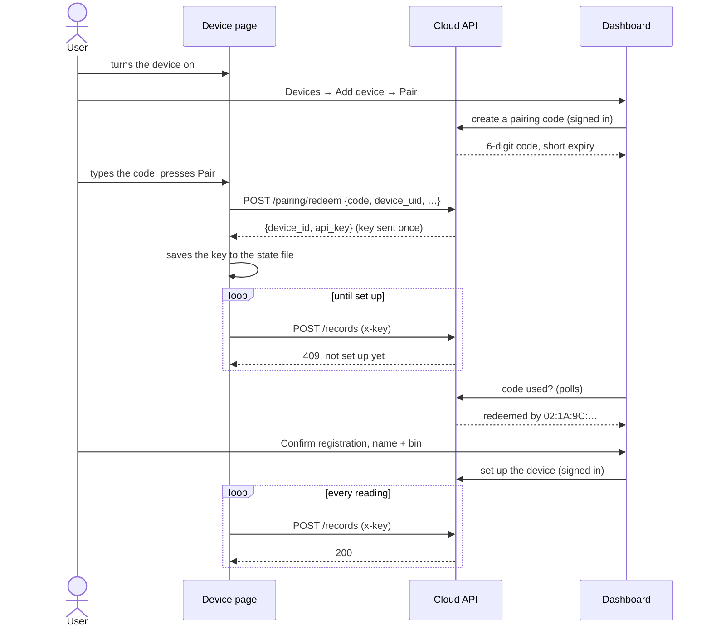

# CompostIQ Device Emulator

A small service that behaves like a real CompostIQ sensor in a compost bin.
It keeps a live model of a pile, takes a reading every few seconds, serves
its own web page for pairing, and once paired pushes readings to the cloud
API, the same way the real hardware will.

It uses only the Python standard library: no framework, no packages. That
keeps it close to what ESP32 firmware could do (one HTTP server, one JSON
page, two outbound HTTPS calls) and keeps the Docker image small.

How it differs from `simulator/`: the simulator generates a whole composting
cycle at once for analysis. The emulator is a device. It runs continuously,
produces one reading at a time, reacts to what you do to the pile, and talks
to the cloud.

## Quick start

```bash
cd emulator
docker compose up -d --build
```

Open <http://127.0.0.1:8080>. With no configuration it talks to the
production cloud at `https://api.compostiq.win`.

To point it at an API on your own machine:

```bash
cp .env.example .env     # then set CLOUD_API_URL=http://host.docker.internal:8000
docker compose up -d
```

More than one device at once: each needs its own project name (so it gets
its own volume, and therefore its own identity) and its own port.

```bash
EMULATOR_PORT=8081 docker compose -p compost-bin-2 up -d
```

Without Docker (Python 3.12+, nothing to install):

```bash
python emulator/main.py
```

## Configuration

Everything is set through environment variables, all optional. Docker reads
them from `emulator/.env`; a local run reads the same file, but never
overrides a variable already set in the shell. `.env.example` lists them all
with comments.

| Variable | Default | What it does |
| --- | --- | --- |
| `CLOUD_API_URL` | `https://api.compostiq.win` | Base URL of the CompostIQ API |
| `PAIRING_PATH` | `/pairing/redeem` | Route that swaps a pairing code for an API key |
| `RECORDS_PATH` | `/records` | Route readings are posted to |
| `HTTP_TIMEOUT_SECONDS` | `10` | Per-request timeout for cloud calls |
| `READING_INTERVAL_SECONDS` | `30` | Real seconds between readings |
| `TIME_SCALE` | `60` | How much faster compost time runs than real time |
| `START_STAGE` | `0` | Stage a new pile starts in (0 Early Mesophilic … 4 Maturation) |
| `AMBIENT_TEMP_C` | `28` | Temperature the pile starts from and cools back to |
| `SEED` | random | Fixed seed for repeatable readings |
| `UPLOAD_BATCH_MAX` | `50` | Most readings sent in one request |
| `QUEUE_MAX` | `1000` | Readings held while offline; the oldest are dropped first |
| `SETUP_CHECK_SECONDS` | `10` | After pairing, how often to check whether the device has been set up in the dashboard |
| `DEVICE_UID` | generated | Pin the hardware ID instead of generating a fake MAC |
| `DEVICE_MODEL` / `FIRMWARE_VERSION` | `CompostIQ Emulator` / `0.1.0` | Sent when pairing and in the `User-Agent` |
| `DEVICE_HOST` / `DEVICE_PORT` | `127.0.0.1` / `8080` | Where the page listens (Docker sets `0.0.0.0:8080`) |
| `STATE_FILE` | `emulator/state/device.json` | Saved state (Docker uses `/data/device.json` on a volume) |
| `EMULATOR_PORT` | `8080` | Port on your machine, for `docker compose` only |
| `LOG_LEVEL` | `INFO` | `DEBUG` also logs every request to the page |

Common values for `CLOUD_API_URL`:

| Setup | Value |
| --- | --- |
| Production | `https://api.compostiq.win` |
| API on your machine, emulator in Docker | `http://host.docker.internal:8000` |
| API and emulator both on your machine | `http://127.0.0.1:8000` |
| The fake cloud (see Testing) | `http://127.0.0.1:8001` |

## The device page

- **Pairing.** Enter the 6-digit code from the dashboard. Once paired, it asks
  you to finish setup in the dashboard (showing the hardware ID to check
  against) until the cloud starts accepting readings. It also shows the cloud's
  device ID, when it was paired, the last four characters of the key, and
  **Factory reset**.
- **Sensors.** The latest temperature, moisture, O₂, CO₂ and ammonia readings,
  with a sparkline and the healthy band for the current stage. Values outside
  the band are flagged. Below that is the pile's actual stage and how far
  through it is, marked *Emulator only* because a real device can't know this.
- **Pile controls.** Turn the pile, add water, add fresh feedstock.
- **Cloud uplink.** Where readings go, when the last batch was sent, how many
  are waiting, and any error. Uploads can be paused, which is handy for
  testing offline behaviour.
- **Activity.** Power on, pairing, actions and uplink events.

## How the pile is simulated

`model.py` is `simulator/generator.py` rewritten to run step by step, and it
reads the same stage table (`simulator/composting_stages.py`), so the two
never disagree. Temperature eases towards each stage's range, moisture
evaporates faster when the pile is active, and the gases follow how active the
pile is. Noise and sensor limits match the simulator.

Readings carry real wall-clock timestamps (UTC, millisecond precision), as a
real device with NTP would. Only the pile runs fast: each reading moves it on
`READING_INTERVAL_SECONDS × TIME_SCALE` seconds of compost time. With the
defaults that's 30 minutes per reading, the simulator's own sample rate, and
an untended pile goes from fresh to maturation in about 8 hours of real time.

The pile responds to care:

| Action | Effect |
| --- | --- |
| Turn | O₂ jumps towards fresh air and CO₂ halves, both fading back over about half a day. The core loses about a fifth of its heat above ambient and recovers. Moisture drops 1.5 %. In the hot stages, each turn extends the stage by half a day (up to 3 days). |
| Add water | Moisture +6 % (capped at 85 %), with a brief small cool-down. |
| Add feedstock | Starts a new batch at stage 0, warming from wherever the pile is now. |
| (neglect) | Below 45 % moisture the microbes slow down: the pile cools and its stage clock slows. Below 30 % it stalls. Above 65 % it becomes waterlogged: O₂ falls and CO₂ rises. |

Unlike the simulator, the pile never gets turned or watered at random: that's
up to you. Left alone, it runs through the stages and then dries out in
maturation.

## Pairing

Pairing and setup are two separate steps. Pairing only swaps a code for a key.
Which bin the device is in, and what it's called, is decided afterwards in the
dashboard. So the code carries nothing but the account, the device never needs
to know about bins, and a setup mistake is fixed in the dashboard without
touching the device.

1. **Turn the device on.** Its page says *Not paired* and shows its hardware ID.
2. **In the dashboard**, open *Devices → Add device* and press **Pair**. The
   dashboard shows a 6-digit code.
3. **On the device's page**, enter the code. The device sends it to the cloud,
   which validates it and returns the device's API key, once.
4. **Back in the dashboard**, which now sees that the code was used and by which
   hardware ID, the user checks it matches the device's page, presses
   **Confirm registration**, and fills in the device's details (name, bin).
5. From then on the cloud accepts the device's readings. Until step 4 is done,
   `/records` answers `409`, and the device's page says *Finish setup in the
   dashboard*.



### What the device needs from the cloud

The API implements this in `backendAPI/routers/pairing.py`, and
`tests/fake_cloud.py` implements it too, for running the emulator without the API.

**`POST {PAIRING_PATH}`** (no auth; the code is the credential)

```json
{
  "code": "004213",
  "device_uid": "02:1A:9C:44:E0:7B",
  "model": "CompostIQ Emulator",
  "firmware_version": "0.1.0"
}
```

Success (`200` or `201`). Only `api_key` is required:

```json
{ "device_id": "7d0a8642-ac25-4828-a58f-6b203b9744e8", "api_key": "<64 hex chars>" }
```

| Status | Meaning | What the device page says |
| --- | --- | --- |
| `404` | Unknown or expired code | wasn't recognised or has expired |
| `409` | Code already used | has already been used |
| `410` | Expired (if the API tells expired apart) | has expired |
| `429` | Too many attempts | wait a few minutes |
| other | anything else | the API's `detail` |

`device_uid` is the device's MAC address, which is what `devices.mac` stores.
Redeeming would create or reuse the `devices` row, make the code's user its
owner, mark the code used and record which device used it, and store only the
key's SHA-256 hash in `device_apikeys`. It would **not** assign a bin.

**`POST {RECORDS_PATH}`** is the API's existing `/records`: header
`x-key: <api_key>`, body a list of readings. It already answers `409` when the
device has no open bin assignment, which is exactly the "not set up yet" signal
the device waits on.

```json
[{ "timestamp": "2026-09-29T02:16:43.349+00:00", "temperature": 61.2,
   "moisture_percent": 54.8, "o2_percent": 3.1, "co2_percent": 8.7, "nh3_ratio": 0.91 }]
```

### The dashboard's side

The device doesn't call these; they're here so the whole flow is in one place.
They're built (`backendAPI/routers/pairing.py`, `devices.py`, `bins.py`), and
the dashboard's `/devices/add` wizard uses them. Details are in the
[API README](../backendAPI/README.md#pairing-a-device).

| Route | Called by | Does |
| --- | --- | --- |
| `POST /pairing/codes` | dashboard (JWT) | Issues `{code, expires_at}` for the signed-in user |
| `GET /pairing/codes/{code}` | dashboard (JWT), polled | `pending`, `expired`, or `redeemed` with the device's ID, hardware ID and model; enables **Next** |
| `POST /devices/{id}/setup` | dashboard (JWT) | Confirms the registration: `{name, bin_id}` (a new bin is made first with `POST /bins`); opens the `device_bin_assn` row |
| `DELETE /devices/{id}` | dashboard (JWT) | "That's not my device", or unpairing later: revokes the key at once |

If the user never confirms, the device stays owned but has no bin: the
dashboard lists it as *Needs setup* with a **Finish setup** button, and the
device keeps checking back every `SETUP_CHECK_SECONDS`.

Checked end to end with the emulator in Docker, the real API and the dashboard:
- pairing, confirming, setting up with a new bin, and the first reading landing in `records`
- resuming setup from the devices page
- "That's not my device" unpairing it, after which the emulator's next call is rejected and it drops back to *Not paired*

## Uplink behaviour

| Cloud answers | Device does |
| --- | --- |
| `2xx` | Removes the sent readings from the queue and sends the next batch straight away |
| `401` / `403` | Treats the key as revoked (e.g. the device was removed in the dashboard): deletes it, drops the queue, and goes back to "not paired" |
| `409` | Paired but not set up in the dashboard yet (or taken out of its bin): shows *Finish setup*, checks back every `SETUP_CHECK_SECONDS`, and holds only its newest reading, so readings from before setup never land in a bin |
| `400` / `413` / `422` | Drops that batch, since resending it can never work, and records how many were dropped |
| `5xx`, `429`, no answer | Keeps the readings and retries after 5 s, 10 s, 20 s … up to 5 minutes. **Retry now** skips the wait. |

The device only queues readings while it's paired. The queue lives in memory,
so readings not yet sent are lost if the emulator restarts.

## Saved state and factory reset

`device.json` holds the hardware ID (a random, locally administered MAC made on
first start), the credentials once paired, and the pile. It's written
atomically and is readable only by its owner, because it holds the API key.
Stopping or rebuilding the container keeps it (it's on the `device-data`
volume), so a paired device picks up where it left off.

**Factory reset** clears the pairing and the key only. The hardware ID stays,
and so does the compost. To start completely fresh:
`docker compose down -v` (or delete `emulator/state/`).

The credentials remember which cloud issued them. If `CLOUD_API_URL` changes,
the device won't send its key to the new address. The page says it's paired
with a different cloud and asks for a factory reset.

## Security notes

- The page has no sign-in, like most devices on a home network. Compose
  publishes it on `127.0.0.1` only. Don't expose it publicly.
- Every POST must be `application/json`. Browsers can't send that cross-site
  without a CORS preflight, which the device never approves, so another
  website can't press the device's buttons.
- The page gets a strict Content-Security-Policy, and only the three files in
  `static/` are served.
- The API key never appears in the page, the status JSON or the logs.

## How this maps to a real device

| Real device | Emulator |
| --- | --- |
| Power on, join Wi-Fi (captive portal) | Not emulated: start the container |
| Local web page over the LAN | `web.py` + `static/` |
| Sensors: temperature probe, capacitive moisture, O₂, CO₂, MQ-135 | `model.py` |
| NVS / flash storage | `state.py`, `device.json` |
| NTP time | The host's clock |
| HTTPS client | `cloud.py` (`urllib`) |
| Retry and buffer when offline | `device.py` uploader |

## Testing

```bash
cd emulator
python -m unittest        # or: pytest
```

The suite has 39 tests and runs in about 2 seconds. It covers the model, pairing,
the wait for setup, every uplink path against the fake cloud, and the web routes.

To try the device without running the API and dashboard, run the fake cloud:

```bash
cd emulator
python -m tests.fake_cloud --port 8001    # add --host 0.0.0.0 if the emulator runs in Docker
```

It prints a pairing code, and stands in for the dashboard with three routes:

| Command | Plays the part of |
| --- | --- |
| `curl -X POST 127.0.0.1:8001/dev/codes` | pressing **Pair**: mints another code |
| `curl -X POST 127.0.0.1:8001/dev/setup` | **Confirm registration**: readings start being accepted |
| `curl -X POST 127.0.0.1:8001/dev/revoke` | removing the device: revokes every key |

## Files

| File | Role |
| --- | --- |
| `main.py` | Entry point: settings, device, web server, clean shutdown |
| `config.py` | Environment variables → `Settings` |
| `model.py` | The live compost pile |
| `device.py` | Sampler and uploader loops, pairing, actions, status |
| `cloud.py` | The two cloud calls |
| `state.py` | The saved state file |
| `web.py` | The device page's HTTP server and JSON routes |
| `static/` | The page: `index.html`, `app.js`, `style.css` |
| `tests/` | Unit tests and `fake_cloud.py` |
| `Dockerfile`, `Dockerfile.dockerignore`, `compose.yaml` | Container build; the build context is the repo root so it can copy `simulator/composting_stages.py` |
